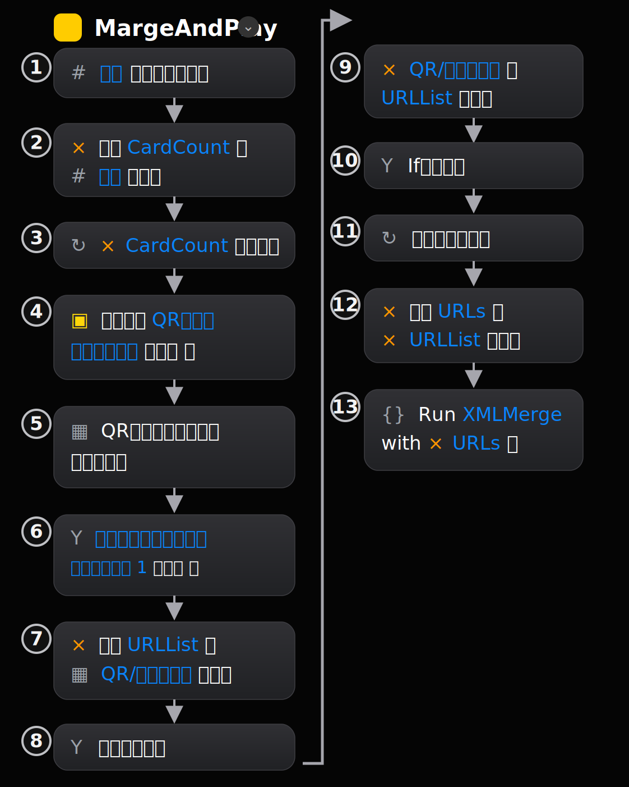

# musicxml-card-script

MusicXML の短い楽譜データを QR コード付きカードにし、iPhone / iPad のショートカットで複数枚を順番に読み取って、1つの MusicXML ファイルに結合するための実験用リポジトリです。

このリポジトリでは、主に次の2つを扱います。

- QR コードから MusicXML の URL を複数読み取る iOS ショートカット `MargeAndPlay`
- 読み取った URL 群から MusicXML を取得し、1つの MusicXML に結合する Scriptable 用スクリプト `XMLMerge-1.1.js`

> 注: ショートカット名はスクリーンショットに合わせて `MargeAndPlay` としています。英語としては `MergeAndPlay` の方が自然ですが、既存名をそのまま使う場合は `MargeAndPlay` のままで構いません。

---

## 全体の流れ

1. MusicXML ファイルをカード単位で用意する。
2. 各 MusicXML ファイルを Web 上に置き、URL を取得する。
3. URL を QR コード化してカードに印刷する。
4. iPhone / iPad のショートカット `MargeAndPlay` で、並べたカードの QR コードを順番に読み取る。
5. 読み取った URL のリストを `XMLMerge` に渡す。
6. Scriptable 上の `XMLMerge-1.1.js` が各 MusicXML を取得して結合する。
7. 結合された MusicXML ファイルを保存・共有し、楽譜アプリなどで開く。

---

## 必要なもの

- iPhone または iPad
- Apple の「ショートカット」アプリ
- Scriptable アプリ
  - 公式 App Store: <https://apps.apple.com/jp/app/scriptable/id1405459188>
  - iPhone / iPad 上で JavaScript を実行できるアプリです。このリポジトリでは、ショートカットから渡された MusicXML URL のリストを受け取り、`XMLMerge-1.1.js` で取得・結合するために使います。
- MusicXML ファイル
- MusicXML ファイルを公開する場所
  - GitHub Pages
  - GitHub Gist
  - 通常の Web サーバ
  - その他、iPhone からアクセスできる URL
- QR コードを印刷するための紙とプリンタ
- 必要に応じて MusicXML を開ける楽譜アプリ
  - 作者の環境では SeeScore 2 を使用しています: <https://apps.apple.com/jp/app/seescore-2/id1515250125>

---

## 事前準備: Scriptable 側の `XMLMerge` を作成する

先に Scriptable に MusicXML 結合用スクリプトを作成します。

1. iPhone / iPad に Scriptable をインストールする。
   - 公式 App Store: <https://apps.apple.com/jp/app/scriptable/id1405459188>
2. Scriptable を開く。
3. 右上の `+` を押して新規スクリプトを作成する。
4. スクリプト名を `XMLMerge` にする。
5. このリポジトリの `XMLMerge-1.1.js` の内容を貼り付ける。
6. 保存する。

ショートカット `MargeAndPlay` の最後では、この `XMLMerge` を呼び出します。したがって、Scriptable 側のスクリプト名と、ショートカットから呼び出す名前を一致させてください。

---

## iOS ショートカット `MargeAndPlay` の目的

`MargeAndPlay` は、次の処理を行うショートカットです。

- 最初に、読み取る QR コードの枚数を数値として受け取る。
- その枚数分だけ QR コードまたはバーコードをスキャンする。
- 1回目の読み取り結果で URL リスト `URLList` を作る。
- 2回目以降の読み取り結果を `URLList` に追加する。
- 完成したリストを `URLs` という変数に入れる。
- `URLs` を入力として `XMLMerge` を実行する。

---

## 共有リンクからショートカットを取得する

手作業で `MargeAndPlay` を作成する代わりに、次の iCloud 共有リンクからショートカットを取得できます。

<https://www.icloud.com/shortcuts/a733c5c148f240468b31b25716c15106>

取得する手順は次のとおりです。

1. iPhone / iPad で上記の iCloud 共有リンクを開く。
2. 「ショートカットを取得」または「ショートカットを追加」をタップする。
3. ショートカットアプリで内容を確認し、必要に応じて `XMLMerge` を呼び出すアクション名を Scriptable 側のスクリプト名に合わせる。
4. 追加後、ショートカット一覧に `MargeAndPlay` が表示されることを確認する。

共有リンクから取得した場合でも、Scriptable 側に `XMLMerge` スクリプトを作成しておく必要があります。

---

## ショートカット作成手順

iPhone / iPad で「ショートカット」アプリを開き、以下の順番でアクションを追加します。

下の図は、スクリーンショットの重複部分を整理し、左列から右列へ折り返して表示したものです。



### 1. 新しいショートカットを作る

1. 「ショートカット」アプリを開く。
2. 右上の `+` を押す。
3. 新しいショートカットの名前を `MargeAndPlay` にする。

---

### 2. アクション一覧

| 順番 | アクション | 設定内容 | 配置場所 |
|---:|---|---|---|
| 1 | 入力から数字を取得 | 入力から数値を取り出す | 最上部 |
| 2 | 変数を設定 | `CardCount` を `数字` に設定 | 最上部 |
| 3 | 繰り返す | `CardCount` 回繰り返す | 最上部 |
| 4 | アラートを表示 | `QRコードを撮影します` と表示 | 繰り返しの中 |
| 5 | QRまたはバーコードをスキャン | QRコードを読み取る | 繰り返しの中 |
| 6 | If | `繰り返しインデックス` が `1` と等しい場合 | 繰り返しの中 |
| 7 | 変数を設定 | `URLList` を `QR/バーコード` に設定 | If の中 |
| 8 | その他の場合 | 2回目以降の処理 | If の中 |
| 9 | 変数に追加 | `QR/バーコード` を `URLList` に追加 | その他の場合の中 |
| 10 | If文の終了 | 条件分岐の終了 | 自動で入る |
| 11 | 繰り返しの終了 | 繰り返しの終了 | 自動で入る |
| 12 | 変数を設定 | `URLs` を `URLList` に設定 | 繰り返しの外 |
| 13 | ショートカットを実行 | `XMLMerge` を `URLs` 付きで実行 | 最後 |

---

## 各アクションの詳しい設定

### 1. 「入力から数字を取得」

ショートカットの入力から、QR コードを読み取る枚数を取得します。

たとえば、実行時に `3` を渡すと、QR コードを3回読み取る想定です。

---

### 2. 「変数 CardCount を 数字 に設定」

「変数を設定」アクションを追加し、変数名を次のようにします。

```text
CardCount
```

値には、直前の「入力から数字を取得」で得た `数字` を指定します。

---

### 3. 「CardCount 繰り返す」

「繰り返す」アクションを追加します。

繰り返し回数には、固定値ではなく変数 `CardCount` を指定します。

---

### 4. 「アラート QRコードを撮影します を表示」

繰り返しの中に「アラートを表示」アクションを入れます。

表示する文言は次のようにします。

```text
QRコードを撮影します
```

これは、次に QR コードを読み取ることを利用者に知らせるためのものです。

---

### 5. 「QRまたはバーコードをスキャン」

繰り返しの中に「QRまたはバーコードをスキャン」アクションを追加します。

このアクションで読み取られた結果が、後続の処理では `QR/バーコード` として使われます。

---

### 6. 「If 繰り返しインデックス が 1 と等しい場合」

「If」アクションを追加します。

条件は次のようにします。

```text
繰り返しインデックス が 1 と等しい場合
```

これは、最初の QR コードだけを `URLList` の初期値として扱うためです。

---

### 7. 1回目の場合: 「変数 URLList を QR/バーコード に設定」

If 文の中に「変数を設定」アクションを入れます。

```text
変数 URLList を QR/バーコード に設定
```

ここで、最初に読み取った QR コードの内容を `URLList` に入れます。

---

### 8. 2回目以降の場合: 「QR/バーコード を URLList に追加」

「その他の場合」の中に「変数に追加」アクションを入れます。

```text
QR/バーコード を URLList に追加
```

これにより、2枚目以降の QR コードの内容が `URLList` に順番に追加されます。

この部分が重要です。最初の1個目は `URLList` を新規作成し、2個目以降は既存の `URLList` に追加します。

---

### 9. 繰り返し終了後: 「変数 URLs を URLList に設定」

繰り返しが終わったら、「変数を設定」アクションを追加します。

```text
変数 URLs を URLList に設定
```

これは、次の `XMLMerge` に渡すための名前を整える処理です。

このアクションは「繰り返しの終了」の外側、つまり繰り返しブロックの下に置いてください。

---

### 10. 最後に `XMLMerge` を実行する

最後に「ショートカットを実行」アクションを追加します。

設定は次のようにします。

```text
Run XMLMerge with URLs
```

つまり、変数 `URLs` を入力として、別ショートカット `XMLMerge` を実行します。

---

## 動作確認

1. `MargeAndPlay` を実行する。
2. 読み取るカード数を入力する。
3. 例として `2` を入力する。
4. 1枚目の QR コードを読み取る。
5. 2枚目の QR コードを読み取る。
6. `XMLMerge` が実行されることを確認する。
7. MusicXML の結合結果が保存または共有されることを確認する。

---

## QR コードカードの作り方

1. カード1枚に対応する短い MusicXML ファイルを作る。
2. その MusicXML ファイルを Web 上に置く。
3. MusicXML ファイルに直接アクセスできる URL を取得する。
4. その URL を QR コード化する。
5. QR コードをカードに印刷する。

カードを並べる順番が、そのまま結合後の MusicXML の順番になります。

---

## 注意点

- QR コードには、`XMLMerge` がアクセスできる MusicXML ファイルの URL を入れてください。
- QR コードの読み取り順序が、そのまま MusicXML の結合順序になります。
- `XMLMerge` という名前を変更した場合は、ショートカット側の「ショートカットを実行」アクションも同じ名前に変更してください。
- 読み取り枚数と実際にスキャンする QR コード数が合わないと、途中で処理が止まります。
- iCloud Drive や Scriptable の権限確認が表示された場合は、内容を確認して許可してください。
- QR コード化する URL は、iPhone / iPad から直接アクセスできる必要があります。

---

## うまく動かないとき

### `XMLMerge` が見つからない

Scriptable 側のスクリプト名が `XMLMerge` になっているか確認してください。

### QR コードを読んでも結合されない

QR コードの中身が MusicXML ファイルへの直接 URL になっているか確認してください。

### 順番が想定と違う

カードを読み取った順番が、そのまま結合順になります。読み取り順を確認してください。

### 1枚目しか処理されない、またはリストにならない

ショートカット内で、1回目は `URLList` に「設定」、2回目以降は `URLList` に「追加」する構成になっているか確認してください。

---

## 関連ファイル

- `XMLMerge-1.1.js`
  - Scriptable に貼り付ける MusicXML 結合用 JavaScript
- `shortcut.md`
  - ショートカット作成手順の補足資料
- `images/margeandplay-shortcut-flow.svg`
  - `MargeAndPlay` の流れを折り返し表示した説明用画像

---

## ライセンス

必要に応じて、このリポジトリに `LICENSE` ファイルを追加してください。
